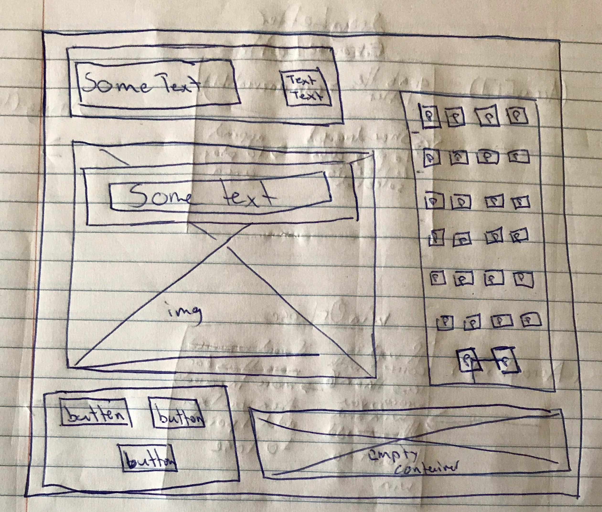
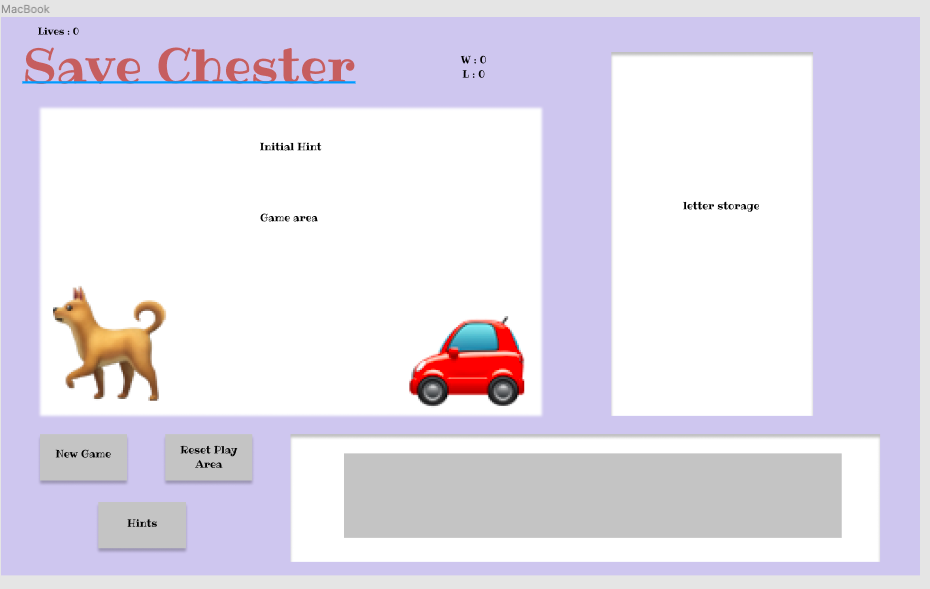

<h1>Save Chester! : Hangman</h1>
<h2>Overview</h2>

For my first project, I decided to create a redesigned hangman named "Save CChester. The player have six attempts to guess the correct movie based on the hint given. If the players fails to do so...unfortunately Chester gets hit by the car. (Whoever the next player is...Save Chester!

<h2>Links</h2>
<a href="https://justinparrish.github.io/project-one/">Game Link</a>
<a href="https://github.com/justinparrish/project-one/projects/1">Project Board</a>
<h2>Technologies Used</h2>
<ul>
    <li>HTML(HyperText Markup Language)</li>
    <li>CSS(Cascading Style Sheets)</li>
    <li>JavaScript</li>
    <li>Figma(Wireframe)</li>
    <li>VS Code(Text editor)</li>
</ul>
<h1>Wireframes</h1>

